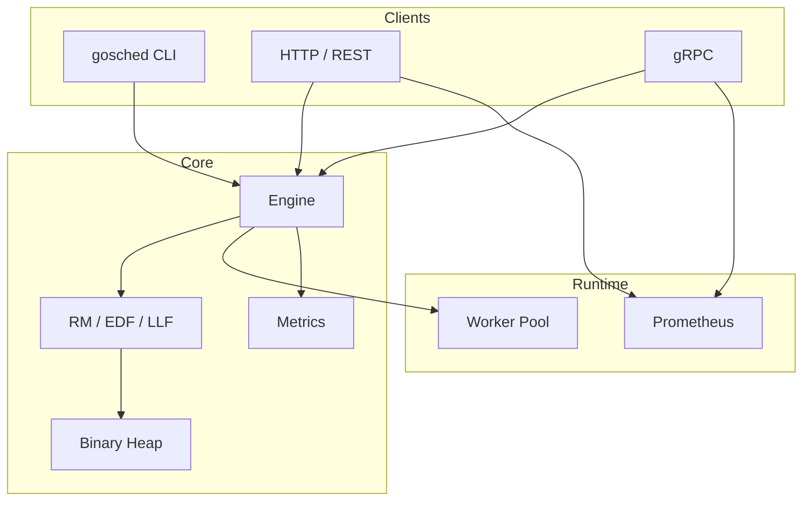

<div align="center">

# GoSched

**Go Scheduler — production-ready real-time task scheduling.**

[](https://github.com/krwg/gosched/actions/workflows/ci.yml)
[](https://goreportcard.com/report/github.com/krwg/gosched)
[](https://go.dev/)
[](LICENSE)
[](docs/api.md)
[](docs/api.md)

</div>

---

**GoSched** is a portfolio-grade library and CLI for **real-time task scheduling** with deadlines, priorities, and parallel workers. It ships three classical algorithms (**RM**, **EDF**, **LLF**), a **custom binary heap**, **gRPC + REST APIs**, **Prometheus metrics**, and a **plugin system** for custom policies.

Built to demonstrate algorithms, data structures, concurrency, and production observability — not CRUD.

---

## Highlights

| | |
|---|---|
| **Algorithms** | Rate Monotonic, Earliest Deadline First, Least Laxity First |
| **Heap** | Custom min-heap — O(log n) push/pop |
| **APIs** | CLI, HTTP JSON, gRPC |
| **Observability** | Prometheus `/metrics`, Gantt ASCII + PNG |
| **Extensibility** | Go plugin loader + `NewCustom` scheduler |
| **Quality** | Unit + integration tests, benchmarks, GitHub Actions CI |

---

## Quick start

```bash
git clone https://github.com/krwg/gosched.git
cd gosched
make build

gosched schedule --algorithm=edf --tasks=tests/fixtures/tasks.json
gosched serve --http :8080 --grpc :50051
```

```bash
curl -s localhost:8080/health
curl -s localhost:8080/metrics
curl -s -X POST localhost:8080/api/v1/schedule -H "Content-Type: application/json" -d @tests/fixtures/tasks.json
```

---

## Installation

```bash
go install github.com/krwg/gosched/cmd/scheduler@latest
```

---

## CLI

| Command | Purpose |
|---------|---------|
| `gosched schedule` | Run simulation from `tasks.json` |
| `gosched visualize` | Render Gantt from result JSON |
| `gosched benchmark` | Compare RM / EDF / LLF |
| `gosched serve` | HTTP + gRPC + Prometheus |

```bash
gosched schedule --algorithm=edf --tasks=tests/fixtures/tasks.json --output=result.json
gosched visualize --input=result.json --output=chart.png
gosched benchmark --algorithms=rm,edf,llf --iterations=1000
gosched serve --http :8080 --grpc :50051 --plugin ./plugin.so
```

---

## Library

```go
res, err := engine.RunQuick(ctx, engine.Config{
    Algorithm:   scheduler.EDF,
    WorkerCount: 4,
}, tasks)
fmt.Printf("completed=%d missed=%d\n", res.Metrics.Completed, res.Metrics.MissedDeadlines)
```

Examples: [`examples/`](examples/)

---

## Architecture



Details: **[docs/architecture.md](docs/architecture.md)**

---

## Documentation

| Doc | Contents |
|-----|----------|
| [Architecture](docs/architecture.md) | Layers, simulation, concurrency |
| [Algorithms](docs/algorithms.md) | RM, EDF, LLF theory + FAQ |
| [API](docs/api.md) | HTTP, gRPC, Prometheus |
| [Plugins](docs/plugins.md) | Custom `.so` schedulers |

---

## Task model

| Field | Description |
|-------|-------------|
| `id` | Unique task ID |
| `duration` | Execution time (ms) |
| `deadline` | Absolute deadline from t=0 (ms) |
| `priority` | 1 (highest) – 10 (lowest) |
| `arrival_time` | When task enters the system (ms) |

Sample: [`tests/fixtures/tasks.json`](tests/fixtures/tasks.json)

---

## Algorithms

| Algorithm | Policy | Use case |
|-----------|--------|----------|
| **RM** | Static priority by period | Periodic hard RT |
| **EDF** | Earliest deadline first | Optimal uniprocessor soft RT |
| **LLF** | Minimum laxity | Dynamic urgency |

---

## Development

```bash
make build
make test
make bench
make lint
make run
make serve
```

---

## Project layout

```
gosched/
├── api/proto/           # gRPC contracts
├── cmd/scheduler/       # CLI + serve
├── internal/
│   ├── engine/          # Simulator
│   ├── heap/            # Priority queue
│   ├── scheduler/       # RM, EDF, LLF
│   ├── server/          # HTTP, gRPC, Prometheus
│   └── plugin/          # Plugin loader
├── pkg/                 # task, visualizer, rpc
├── examples/
├── docs/
└── tests/
```

---

## Contributing

1. Fork and branch from `main`
2. Add tests for new behavior
3. Run `make test` and `make lint`
4. Open a PR with a clear description

---

## License

MIT — [krwg](https://github.com/krwg)
